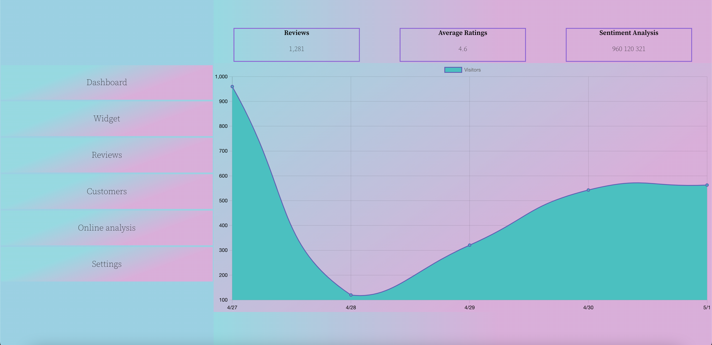

# React DashBoard
This small project is a combination of my knowledge of React, HTML, and CSS. 

Image of what my app looks like. 

### Technologies used
Languages: HTML, CSS, JavaScript, JSX
Frameworks: React 

###### Additional Libraries: 
In addition to using `create-react-app` to setup my app, I also used `react-chartjs-2: ^4.1.0` and `chart.js: ^3.7.1` to create the graph. You can visit https://react-chartjs-2.js.org/components/ for more information and documentation. 

You can download both of these by going to your terminal or any equivalent and using the command: 
> npm install react-chartjs-2 chart.js

### Contributing
1. If you would like to contribute or view my code you can either
`git clone https://github.com/SunghunP/react-dashboard`
or fork my repository. 
2. Create a new branch `git checkout -b myBranch`
3. Add & commit your code and create a pull request!
